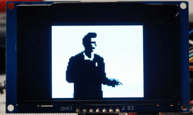

# SSD1309 SPI OLED Demo with Linux

In this demo, I use an 128x64 OLED display with an Olinuxino A20 Micro board.
I use the in-tree ssd130x DRM driver in the Linux mainline kernel v6.3, allowing
me to use X11 to draw to the screen via the /dev/fb0 framebuffer device and 
X11 fbdev driver. The Linux image is created using Yocto Kirkstone.

## Hardware
I use the display in SPI mode. On the Olinuxino board, I connected it to 
`CLK`, `MOSI` and `CS0` of `SPI1` (`UEXT2` connector).
The `DC` signal is connected to `PH0` (`GPIO-3` pin 5), the `RES` signal to
`PH7` (`GPIO-3` pin 9). 

### Device tree options
Apparently some SSD1309 are wired in weird configurations, i.e., remapped
rows and column and offsets. 
To configure this, the kernel driver provides multiple custom
devicetree bindings (e.g., segment-no-remap).
I found those by trial-and-error.

## Demo build
To create this demo, I enabled the build of an X server in the Yocto configuration
and installed twm, xclock and mpv (for video playback) and their dependencies.
However, it should also be possible to skip the X server and directly access
`/dev/fb0` for simple applications. Wayland should work as well.

I use Yocto Kirkstone to set up this demo.

### Kernel
I am using the linux-yocto-dev kernel v6.3. Because meta-sunxi does not 
provide a defconfig for this kernel version, I supply it in this layer.
For a real project, it would probably be better to put this into a separate layer
and to only use configuration fragments to enable the ssd130x drivers 
in this layer.

### Dependencies
This yocto layer depends on
~~~
URI: https://github.com/linux-sunxi/meta-sunxi
branch: kirkstone
~~~
which provides the machine file for Olinuxino-A20 and build recipes.

### Build 
Adding the meta-ssd1309 layer to your build
~~~
Run 'bitbake-layers add-layer meta-ssd1309'
~~~

The changes I made to my distro and meta-sunxi are found in /patches.

To build the image, I used
~~~
bitbake core-image-x11
~~~

